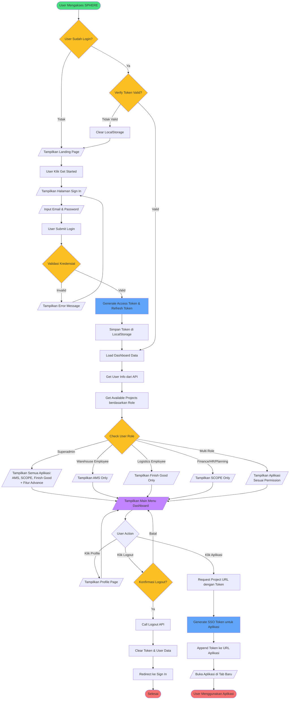

# SPHERE System Flowchart

## Deskripsi Sistem
SPHERE (Sanoh Portal for Hybrid Enterprise Resource Environment) adalah sistem superapp portal yang menghubungkan beberapa aplikasi internal Sanoh:
- **AMS** (Arrival Monitoring System) - untuk warehouse employee
- **SCOPE** (Sanoh Central Operation for Production Evaluation) - untuk finance, warehouse, logistics, HR, planning employee
- **Finish Good Store** - untuk logistics employee

Sistem menggunakan **Single Sign-On (SSO)** untuk autentikasi terpusat yang mengirimkan auth token ke setiap aplikasi.

## Flowchart Sistem SPHERE

## Penjelasan Alur

### 1. **Authentication Flow**
- User mengakses SPHERE dan diperiksa status autentikasinya
- Jika belum login, ditampilkan landing page dengan tombol "Get Started"
- User input email dan password untuk login
- Sistem validasi kredensial dan generate JWT token (access & refresh token)
- Token disimpan di localStorage untuk session management

### 2. **Authorization & Dashboard**
- Setelah login, sistem verify token validity
- Load user information dan available projects berdasarkan role
- Dashboard menampilkan aplikasi sesuai permission user:
  - **Superadmin**: Akses semua aplikasi + fitur advance
  - **Warehouse Employee**: AMS only
  - **Logistics Employee**: Finish Good only
  - **Finance/HR/Planning**: SCOPE only
  - **Multi-role**: Kombinasi sesuai permission

### 3. **SSO Integration**
- User klik aplikasi yang ingin diakses
- SPHERE request project URL dengan menyertakan token
- Backend generate SSO token khusus untuk aplikasi tersebut
- Token di-append ke URL dan aplikasi dibuka di tab baru
- **User dialihkan ke aplikasi target** (di luar scope SPHERE)

### 4. **Session Management**
- User dapat logout dari SPHERE (clear semua token)
- User dapat akses profile untuk melihat informasi akun
- Token auto-refresh untuk maintain session
- Jika token expired, user di-redirect ke sign in page

## Batasan Diagram

Flowchart ini **hanya mencakup scope aplikasi SPHERE Portal**, yaitu:
- ✅ Landing page
- ✅ Authentication (Sign In/Logout)
- ✅ Dashboard & Main Menu
- ✅ Profile Management
- ✅ SSO Token Generation
- ✅ Redirect ke aplikasi eksternal

**Tidak mencakup**:
- ❌ Detail fitur di dalam aplikasi AMS
- ❌ Detail fitur di dalam aplikasi SCOPE
- ❌ Detail fitur di dalam aplikasi Finish Good

Setelah user membuka aplikasi melalui SSO, alur keluar dari scope SPHERE dan masuk ke scope aplikasi masing-masing.

## Keamanan
- JWT-based authentication
- Token stored in localStorage
- Auto token verification on page load
- Secure SSO token generation per application
- Automatic logout on token expiration
