# SPHERE System Use Case Diagram

## Use Case Diagram menggunakan PlantUML

```plantuml
@startuml SPHERE_Use_Case_Diagram

skinparam packageStyle rectangle

title SPHERE System - Use Case Diagram

' Actors
actor "Guest User" as Guest
actor "Authenticated User" as User
actor "Warehouse Employee" as Warehouse
actor "Logistics Employee" as Logistics
actor "Finance Employee" as Finance
actor "HR Employee" as HR
actor "Planning Employee" as Planning
actor "Superadmin" as Admin

' Actor Inheritance
Guest <|-- User
User <|-- Warehouse
User <|-- Logistics
User <|-- Finance
User <|-- HR
User <|-- Planning
User <|-- Admin

' SPHERE Portal Package
package "SPHERE Portal (SSO System)" {
    
    ' Authentication Use Cases
    package "Authentication Module" {
        usecase "View Landing Page" as UC1
        usecase "Sign In" as UC2
        usecase "Verify Token" as UC3
        usecase "Logout" as UC4
        usecase "Refresh Token" as UC5
    }
    
    ' Dashboard Use Cases
    package "Dashboard Module" {
        usecase "View Main Menu" as UC6
        usecase "View Profile" as UC7
        usecase "Update Profile" as UC8
        usecase "View Available Apps" as UC9
    }
    
    ' SSO Use Cases
    package "SSO Integration Module" {
        usecase "Generate SSO Token" as UC10
        usecase "Access Application\nvia SSO" as UC11
    }
    
    ' Application Access Use Cases
    package "Application Access" {
        usecase "Access AMS" as APP1
        usecase "Access SCOPE" as APP2
        usecase "Access Finish Good" as APP3
    }
}

' Guest User Use Cases
Guest --> UC1 : views

' Authenticated User Use Cases
User --> UC2 : performs
User --> UC3 : triggers
User --> UC4 : performs
User --> UC6 : views
User --> UC7 : views
User --> UC8 : performs
User --> UC9 : views

' Warehouse Employee Use Cases
Warehouse --> APP1 : accesses

' Logistics Employee Use Cases
Logistics --> APP2 : accesses (partial)
Logistics --> APP3 : accesses

' Finance Employee Use Cases
Finance --> APP2 : accesses (partial)

' HR Employee Use Cases
HR --> APP2 : accesses (partial)

' Planning Employee Use Cases
Planning --> APP2 : accesses (partial)

' Superadmin Use Cases (All Access)
Admin --> APP1 : accesses (full + advanced)
Admin --> APP2 : accesses (full + advanced)
Admin --> APP3 : accesses (full + advanced)

' System Relationships
UC2 ..> UC3 : <<include>>
UC2 ..> UC10 : <<include>>
UC6 ..> UC3 : <<include>>
UC4 ..> UC3 : <<include>>

UC3 ..> UC5 : <<extend>>\n(if token expired)

' Application Access via SSO
APP1 ..> UC11 : <<include>>
APP2 ..> UC11 : <<include>>
APP3 ..> UC11 : <<include>>

UC11 ..> UC10 : <<include>>

note right of UC10
  SSO Token digenerate untuk
  setiap aplikasi yang diakses
  dan dikirim sebagai auth token
end note

note bottom of Admin
  Superadmin memiliki akses
  ke semua aplikasi dan
  semua fitur advance
end note

note bottom of Warehouse
  Warehouse Employee hanya
  dapat mengakses AMS
end note

note bottom of Logistics
  Logistics Employee dapat
  mengakses Finish Good dan
  sebagian fitur SCOPE
end note

note bottom of Finance
  Finance, HR, dan Planning
  Employee dapat mengakses
  SCOPE sesuai departemen
end note

note left of APP1
  Detail fitur AMS berada
  di luar scope SPHERE
end note

note left of APP2
  Detail fitur SCOPE berada
  di luar scope SPHERE
end note

note left of APP3
  Detail fitur Finish Good
  berada di luar scope SPHERE
end note

@enduml
```



## Deskripsi Use Case

### **Actors (Pengguna Sistem)**

1. **Guest User**: Pengunjung yang belum login
2. **Authenticated User**: User yang sudah login (base actor)
3. **Warehouse Employee**: Karyawan gudang (akses AMS)
4. **Logistics Employee**: Karyawan logistik (akses Finish Good + sebagian SCOPE)
5. **Finance Employee**: Karyawan finance (akses SCOPE - Financial Analysis)
6. **HR Employee**: Karyawan HR (akses SCOPE - HR Management)
7. **Planning Employee**: Karyawan planning (akses SCOPE - Production Planning)
8. **Superadmin**: Administrator sistem (akses semua aplikasi + fitur advance)

### **Use Cases per Module**

#### **1. Authentication Module**
- **UC1 - View Landing Page**: Guest user melihat halaman landing SPHERE
- **UC2 - Sign In**: User melakukan login dengan email/username dan password
- **UC3 - Verify Token**: Sistem memverifikasi JWT token validity
- **UC4 - Logout**: User melakukan logout dari sistem
- **UC5 - Refresh Token**: Sistem refresh token otomatis saat expired

#### **2. Dashboard Module**
- **UC6 - View Main Menu**: User melihat dashboard utama dengan aplikasi yang tersedia
- **UC7 - View Profile**: User melihat informasi profil
- **UC8 - Update Profile**: User mengupdate informasi profil
- **UC9 - View Available Apps**: User melihat daftar aplikasi sesuai role

#### **3. SSO Integration Module**
- **UC10 - Generate SSO Token**: Sistem generate SSO token untuk aplikasi target
- **UC11 - Access Application via SSO**: User mengakses aplikasi melalui SSO

#### **4. Application Access**
- **APP1 - Access AMS**: User mengakses aplikasi AMS (Arrival Monitoring System)
- **APP2 - Access SCOPE**: User mengakses aplikasi SCOPE (Central Operation)
- **APP3 - Access Finish Good**: User mengakses aplikasi Finish Good Store

### **Relationships**

#### **Include Relationships**
- Sign In **includes** Verify Token
- Sign In **includes** Generate SSO Token
- View Main Menu **includes** Verify Token
- Logout **includes** Verify Token
- Access AMS **includes** Access Application via SSO
- Access SCOPE **includes** Access Application via SSO
- Access Finish Good **includes** Access Application via SSO
- Access Application via SSO **includes** Generate SSO Token

#### **Extend Relationships**
- Verify Token **extends to** Refresh Token (jika token expired)

### **Access Control Matrix**

| Role | AMS | SCOPE | Finish Good | Advanced Features |
|------|-----|-------|-------------|-------------------|
| Superadmin | ✅ Full | ✅ Full | ✅ Full | ✅ All |
| Warehouse Employee | ✅ Full | ❌ | ❌ | ❌ |
| Logistics Employee | ❌ | ✅ Partial (Logistics) | ✅ Full | ❌ |
| Finance Employee | ❌ | ✅ Partial (Finance) | ❌ | ❌ |
| HR Employee | ❌ | ✅ Partial (HR) | ❌ | ❌ |
| Planning Employee | ❌ | ✅ Partial (Planning) | ❌ | ❌ |

### **Batasan Diagram**

Use case diagram ini **hanya mencakup scope aplikasi SPHERE Portal**, yaitu:
- ✅ Authentication & Authorization
- ✅ Dashboard & Profile Management
- ✅ SSO Token Generation
- ✅ Akses ke aplikasi eksternal (AMS, SCOPE, Finish Good)

**Tidak mencakup**:
- ❌ Detail use case di dalam aplikasi AMS
- ❌ Detail use case di dalam aplikasi SCOPE
- ❌ Detail use case di dalam aplikasi Finish Good

Setelah user mengakses aplikasi melalui SSO (APP1, APP2, APP3), detail fitur dan use case berada di luar scope SPHERE dan menjadi tanggung jawab aplikasi masing-masing.

## Cara Menggunakan PlantUML

### Online
1. Kunjungi [PlantUML Online Editor](https://www.plantuml.com/plantuml/uml/)
2. Copy-paste kode PlantUML di atas
3. Diagram akan ter-generate otomatis

### VS Code
1. Install extension "PlantUML"
2. Buat file dengan ekstensi `.puml` atau `.plantuml`
3. Copy-paste kode di atas
4. Tekan `Alt+D` untuk preview

### Command Line
```bash
# Install PlantUML
npm install -g node-plantuml

# Generate diagram
puml generate SPHERE_USE_CASE.puml -o output.png
```
